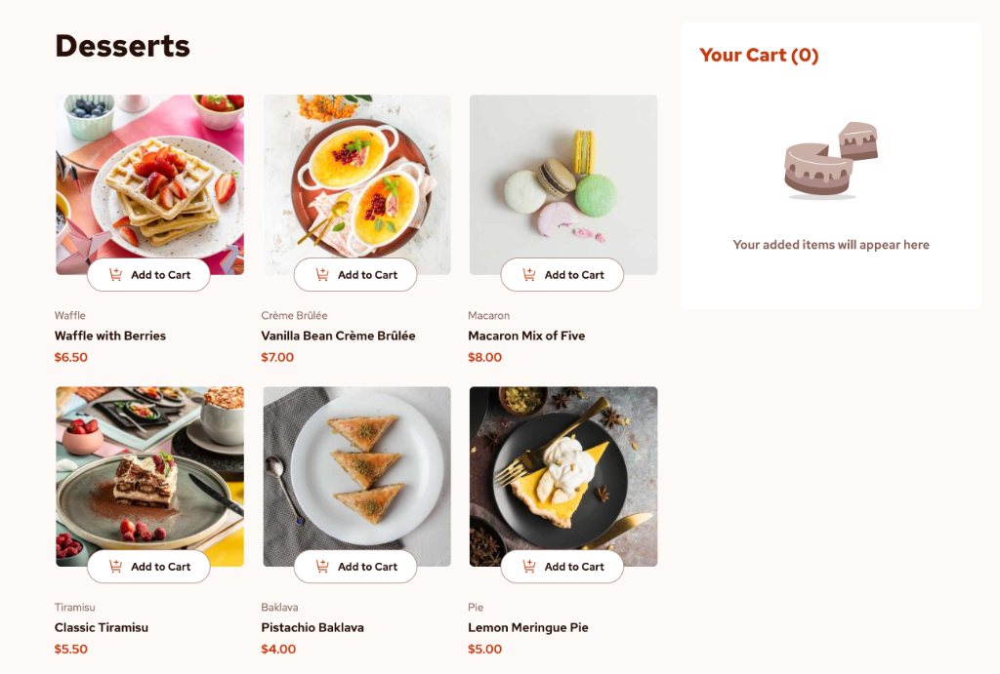

# Frontend Mentor - Product list with cart solution

This is a solution to the [Product list with cart challenge on Frontend Mentor](https://www.frontendmentor.io/challenges/product-list-with-cart-5MmqLVAp_d). Frontend Mentor challenges help you improve your coding skills by building realistic projects. 

## Table of contents

- [Overview](#overview)
  - [The challenge](#the-challenge)
  - [Screenshot](#screenshot)
  - [Links](#links)
- [My process](#my-process)
  - [Built with](#built-with)
  - [What I learned](#what-i-learned)
  - [Testing Strategy](#testing-strategy)
  - [Continued development](#continued-development)
  - [AI Collaboration](#ai-collaboration)
- [Author](#author)

**Note: Delete this note and update the table of contents based on what sections you keep.**

## Overview

### The challenge

Users should be able to:

- Add items to the cart and remove them
- Increase/decrease the number of items in the cart
- See an order confirmation modal when they click "Confirm Order"
- Reset their selections when they click "Start New Order"
- View the optimal layout for the interface depending on their device's screen size
- See hover and focus states for all interactive elements on the page

### Screenshot

Add a screenshot of your solution. The easiest way to do this is to use Firefox to view your project, right-click the page and select "Take a Screenshot". You can choose either a full-height screenshot or a cropped one based on how long the page is. If it's very long, it might be best to crop it.

Alternatively, you can use a tool like [FireShot](https://getfireshot.com/) to take the screenshot. FireShot has a free option, so you don't need to purchase it. 

Then crop/optimize/edit your image however you like, add it to your project, and update the file path in the image above.

**Note: Delete this note and the paragraphs above when you add your screenshot. If you prefer not to add a screenshot, feel free to remove this entire section.**

### Links

- Solution URL: [Add solution URL here](https://your-solution-url.com)
- Live Site URL: [Add live site URL here](https://your-live-site-url.com)

## My process

### Built with

- HTML5 
- Vanilla CSS
- React 
- Vite 
- Biome

### What I learned 

  Structure Plan

During the development of this project, I adopted a strict **Data Flow First** architecture. By prioritizing logic before styling, I avoided common UI pitfalls. Here is my strategic approach to building the React component structure:

**1. Data Flow First (Making State Work)**
Before writing any styling, I focused on implementing the core logic in `App.jsx`. I prioritized mapping the `addToCart` function directly to the `cartItems` state using `setCartItems()` rather than just logging outputs. 
*Why?* Ensuring the core data structures are accurate and reliable is paramount before worrying about aesthetic presentation.

**2. Raw Rendering in Cart**
To verify communication across components, I passed the `cartItems` state down to the `<Cart />` component and rendered the data as a raw, unstyled list (`<li>`). This allowed me to immediately confirm that clicking a product card successfully inserted the product into the global state.

**3. Dynamic UI on ProductCard**
A significant challenge was managing the state of the individual `<ProductCard />` buttons. Based on the design, when a user clicks "Add to Cart", the button dynamically morphs into a Quantity Selector (+ / -). This requires the `<ProductCard />` to be "aware" of its own status within the global cart. Building this conditional logic early prevented severe structural refactoring later.

**4. Refining UI & Interactions (Cart & CartItem)**
Once the data flow and conditional rendering were solid, I focused on refining the UI structure. I calculated the precise `Total Price`, implemented the item removal logic (X button), and focused on CSS styling confidently, knowing the underlying state management was functioning perfectly.

  

  ### Challenges & Discoveries

While building this project, I encountered several challenges that significantly deepened my understanding of React:

- **Vite's Static Asset Handling:** I initially struggled with referencing `data.json` and images due to Vite's strict separation between the `src` and `public` directories. This taught me how modern bundlers resolve file paths differently than traditional setups.
- **The Importance of React Keys:** Understanding why React strictly requires a unique `key` prop (e.g., `key={item.name}`) when mapping lists. I learned that this is critical for React's reconciliation process to efficiently update the DOM and prevent rendering bugs later on.
- **Debugging `undefined` and `NaN` States:** I encountered severe bugs where React could not find the state (`undefined`) or calculations returned `NaN` because objects were missing essential properties (like `quantity`). This emphasized the importance of setting robust initial states.
- **Mastering "Data Down, Actions Up":**
  - **Callback Functions:** A major breakthrough was understanding how the `addToCart` function defined in the parent (`App.jsx`) is passed down and triggered by an `onClick` event in the child (`ProductCard.jsx`), piping data back up via parameters.
  - **Dynamic Button Morphing:** Implementing the logic to recognize when a product is *already* in the cart, allowing the simple "Add to Cart" button to dynamically transform into a fully functional `- / +` quantity selector.
  - **Handling Decrements:** I learned how to pass a specific `removeFromCart(productName)` callback to handle the `-` button, ensuring the parent state accurately updates the specific item's quantity down to zero.
- **Conditional Modals:** Implementing an Order Confirmation Modal that relies on evaluating the global state rather than relying on complex DOM manipulation.

### Testing Strategy

To ensure a robust and bug-free user experience, this project implements a professional multi-layered testing strategy:

1. **Unit Testing (Vitest & RTL):** 
   - Focused on testing isolated components and pure functions, such as the `totalPrice` calculation inside the `Cart` component.
   - Ensures that individual components render correctly when provided with specific mock data (e.g., rendering an empty cart state vs. a populated cart).

2. **Integration Testing (React Testing Library & user-event):**
   - Simulates user interactions to verify that components communicate effectively.
   - For example, testing the flow in `App.jsx` where a user clicks "Add to Cart" on a `ProductCard`, and verifying that the `Cart` state and UI update immediately.

3. **End-to-End (E2E) Testing (Playwright):**
   - Runs automated user journeys on a real browser rendering engine (Chromium, WebKit, Mobile Safari).
   - Simulates the entire checkout process: opening the app, clicking multiple products, increasing quantities, opening the Order Confirmation Modal, and finally resetting the cart.

4. **Manual & Visual QA:**
   - Cross-browser and responsive checks using Chrome DevTools.
   - Fine-tuning CSS parameters to match the Figma design (Pixel-perfect approach).
   - Mobile-first approach checks to ensure overlays and bottom sheets (Modal) behave naturally on
    smaller viewport sizes.

### Continued development

This project serves as a solid foundation for a full-fledged e-commerce application. Building upon this, my next steps for continued development include:

- **Real Payment Processing:** Integrating a payment gateway (such as Stripe or PayPal) to transition from a mock confirmation modal to actual secure transactions.
- **E-commerce Platform Integration:** Expanding the scope of this project so this cart system becomes a modular component within a larger, fully functional online store.
- **Discount & Coupon System:** Implementing a feature that allows users to apply promotional codes securely to dynamically recalculate their total order price.
- **User Authentication & Membership:** Building a robust login system to track user order history, save billing/shipping details, and offer member-exclusive discounts or loyalty points.

### AI Collaboration

Anitigravity with Gemini 3.1 Pro (High)

## Author

- Website - [Add your name here](https://www.your-site.com)
- Frontend Mentor - [@yourusername](https://www.frontendmentor.io/profile/yourusername)
- Twitter - [@yourusername](https://www.twitter.com/yourusername)

**Note: Delete this note and add/remove/edit lines above based on what links you'd like to share.**

